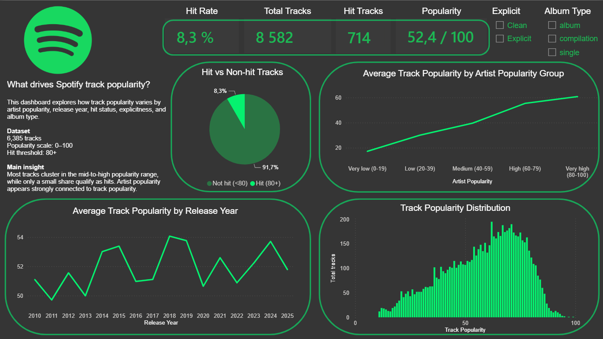
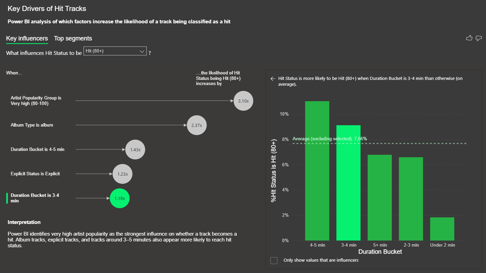

# spotify-popularity-dashboard
Power BI dashboard analyzing Spotify track popularity using Excel and Power BI.

The goal is to explore which factors are associated with higher Spotify track popularity and hit likelihood.

## Tools used

- Excel
- Power BI
- DAX

## Dataset

The dataset contains Spotify track and artist information, including:

- Track popularity
- Artist popularity
- Artist followers
- Album type
- Explicit status
- Release year
- Duration
- Primary genre

## Dashboard pages

### 1. Overview

Shows overall track popularity patterns, hit rate, artist popularity groups, release year trends, and popularity distribution.

### 2. Popularity Drivers

Explores hit rate by genre, hit rate by album type, and average popularity by track duration.

### 3. Key Influencers

Uses Power BI's Key Influencers visual to identify which factors increase the likelihood of a track becoming a hit.

## Key insights

- Tracks by very popular artists are more likely to become hits.
- Album tracks have a higher hit rate than singles and compilations.
- Tracks around 3–5 minutes show higher average popularity.
- Some genres have higher hit rates, but genre comparisons should be interpreted carefully when sample sizes are small.

## Files

- `Spotify_Dashboard.pbix` — Power BI dashboard file
- `spotify_data_clean.csv` — cleaned dataset
- `screenshots/` — dashboard screenshots

## Dashboard preview

